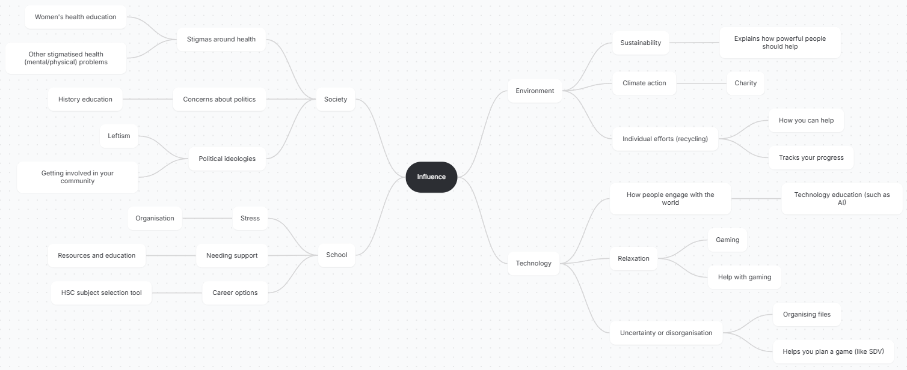

# Identify & Define
## Divergent Thinking

### Mindmap

### 6 Big Ideas
| Idea Name | What It Does | Influence it Explores | Who It Helps |
| - | - | - | - |
| Women's health | Educates about health problems which usually affect women | Influenced by society and medical misogyny | Women struggling with those health problems and people who don't understand them / think they're not that bad
| Leftism | Educates about how to get involved in leftist organisations locally |Influenced by society (politics) | People interested in politics who don't know how to get involved
Environment |Explains how you can help, how powerful people should help, and educates on environmental issues | Influenced by the earth and the environment |People who care for the environment
Stardew Valley | Gives a space to plan your stardew valley save and also gives important information depending on your input | Influenced by technology and gaming | New or experienced Stardew Valley players
HSC subject selection, or electives selection | Tells you which subjects you should pick, and some information about them, based on the info you put in | Influenced by school and HSC anxiety | Students who are unsure of subjects
Artificial Intelligence | Gives helpful alternatives to AI and explains why it's bad |Influenced by technology | People wanting to quit AI or curious about its impacts

## Convergent Thinking

### Impact Effort Matrix

### Peer SWOT Analysis
| Idea Name | Strengths | Weaknesses | Opportunities | Threats
| - | - | - | - | - |
Women's health | Very original, interesting, and could make a big positive impact | Not entirely sure who the target audience would be | You could add a thing which shows people which of the health issues are most common and sort that way as well | It might be hard to choose which women's health issues to include because you probably couldn't do all of them
| - | Good idea, it helps a very under explored issue within society idk bro. very relavent is a positive impact. | idk | What other features? | idk |
| - | OOOH YES RANDOM ONE COOL GOOD ME LIKEY. CUZ ME NO WANT TO CHOOSE STUFF WEBSITE CHOOSE FOR MEEEEEE. | How is this about influence? Juuuuuuuust saying. | Idk make a section dedicated to men learning about it. Cuz they are probably just as important as women. a tab that's like 'a man's guide to women's health issues' or smth. | Idk man.
HSC selection | Very relevant with a clear target audience and high potential | I feel like this might already exist? | You could add which fields different courses could lead to | Might be hard to personalise information about the courses to your school
| - | Very relevant to us. | peersonnally that sounds hard to do like all the courses and school and stuff. | like a quiz sort of thing? that interactive and engaging | no threats i think.
| - | YES MAKE A WEBSITE THAT ISN"T bad CUZ THE CAREERS DEPARTMENT IS donkey. Also very useful for students who are unsure of themselves or the des | OMG I HAVE TO REVEAL INFORMATION ABOUT WHAT SCHOOL I GO TO???? WILL MY DATA BE SAFE?????? HOW WILL IT BE STORED??? | Can be very helfpul, and a source of INFLUENCE. | There's a lot of these things already. You'd need to make urs stand out.

(guess which one's was juliet's)

### Reflect and Choose
The impact-effort matrix suggests that the ideas which prioritise entertainment (gaming) or apps with a more personal influence (HSC subject selection) tend to take more effort to implement, and are also the less impactful options, so they are the first options which should be taken off the list. On the topic of the impact-effort matrix, all other options are around the same place; high impact, low effort, which is ideal for a project with a time limit. The peer SWOT analysis contrasts a low-impact high-effort idea with a high-impact low-effort idea. The idea of a website educating about women's health was well-liked by my peers, some discussing its positive impact and the importance of the issue. It was criticised for an unclear target audience or influence. The HSC subject selection was also liked by my peers for its relevance to our current high school life. A definite issue with it is its pre-existing competition. In the end, I've decided to go for the women's health website.

## Requirements Outline
### Functional Requirements
- The website must include:
    - Different pages with different health problems
        - A small summary
    - External links & references
    - An 'about us' page
    - A randomisation feature
    - A login option (to be able to comment)
    - An ability to comment (using flask)
- The user should have the ability to request new pages to be added

### Non-Functional Requirements
- The website's navigation should be accessible and easy
- The user should be able to navigate the website with minimal lag
- The information should be accurate and reliably sourced
- The website should look uniform
- The website could include:
    - A donation box

# Research and Planner
## Explore Existing Ideas
Idea | Plus | Minus | Implication
| - | - | - | - |
| Wikipedia | Educates the user on an extremely large amount of topics, being very influential for education and personal research. | Some may claim the articles are unreliable as many articles can be edited by anyone and everyone. | Generally a very positive and influential website, as the negative aspects are rectified by heavy moderation.
| Internet Archive | Saves many years of internet history and gives us a look back on how different websites used to look | Some suggest it isn't regulated very well, leading to piracy concerns | Generally a useful and interesting tool
| Fandom | Gives useful information on a variety of entertainment | Some users say it is too ad-heavy | Popular and a great tool for fans of games, shows, and movies, especially artists or writers

## Secondary Research
Medical misogyny is a serious and promiminent issue both within the medical research field, but also in medical practice. The stigmatisation of women's health issues such as sexual and reproductive health care (like STI treatment, abortion, and contraception), mental health conditions, menstrual problems and more, lead to possibly life-threatening consequences for struggling women. According to the Australian Department of Health, 2 in 3 women experience discrimination in healthcare at some point in their lives.

Stigmatisation of women's health problems can lead to medical malpractice, incorrect diagnoses, ignorance to serious health conditions, and more. By bringing light to these health issues, their consequences, their symptoms, as well as the prevalence of medical misogyny, we increase awareness and support women who are at risk due to being discriminated against.

https://www.health.gov.au/ministers/the-hon-ged-kearney-mp/media/2-out-of-3-women-experience-discrimination-in-healthcare-0?language=en
https://pmc.ncbi.nlm.nih.gov/articles/PMC7887974/
https://womenshealth.gov/nwhw/day-4-talk-about-it-reducing-womens-health-stigma

## Primary Research
Results from the survey tba
